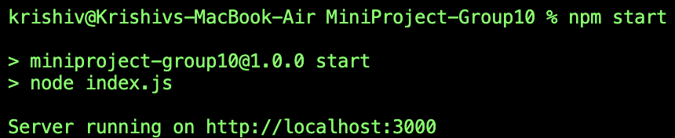
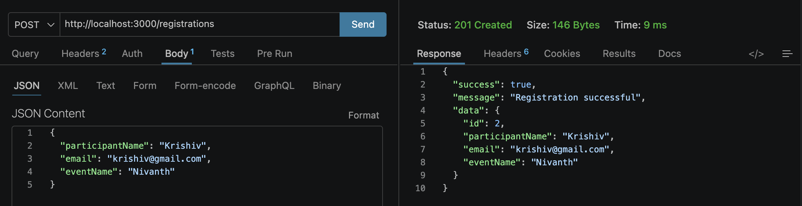
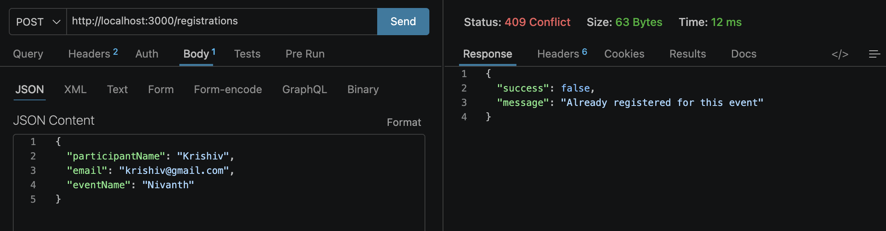
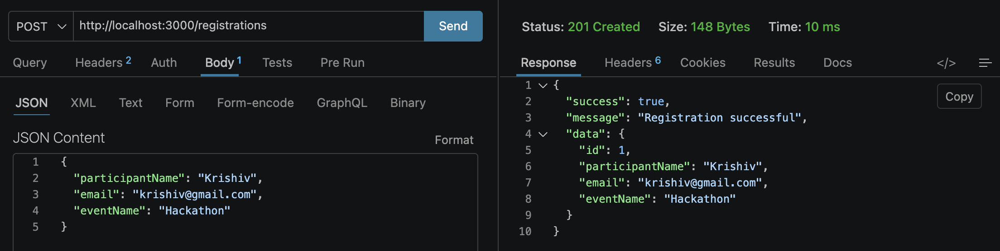
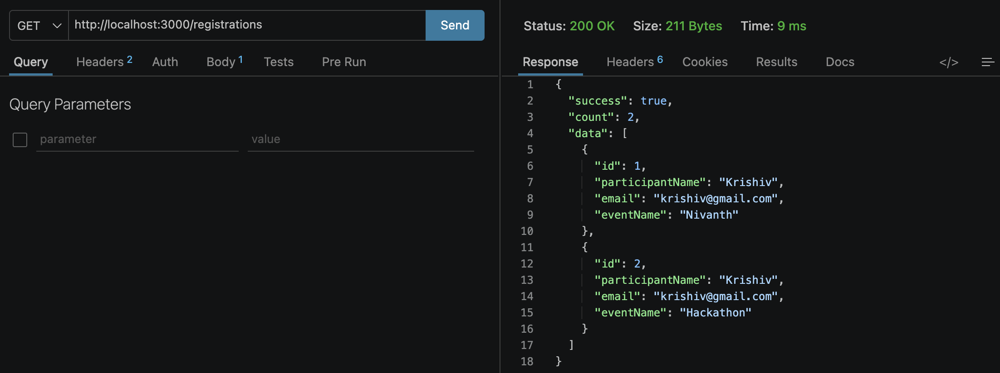

# MiniProject-Group10

## Objectives
The main objectives of this project are:

- To design a simple API for event registration.
- To store participant data in a JSON file.
- To validate the required inputs before saving records.
- To prevent duplicate registrations for the same event and email.
- To provide an easy way to fetch all registrations.
- To build a lightweight backend application suitable for learning and academic demonstration.

## Setup Instructions
Follow the steps below to run the project locally:

1. Open the project folder in your terminal.
2. Install dependencies:

```bash
npm install
```

3. Start the server:

```bash
npm start
```

4. The server will run on:

```text
http://localhost:3000
```

## Proof of work

### 1. Server Startup
The application starts successfully and is ready to accept incoming HTTP requests.


### 2. Successful POST Request for Registration
A new participant is registered successfully using the POST endpoint.


### 3. Duplicate Registration Prevention
The API rejects duplicate registrations for the same participant and event combination.


### 4. Registration Response Body
The response includes a success message and the newly created registration details.


### 5. GET Request to View All Registrations
The system returns all saved registrations in JSON format.


